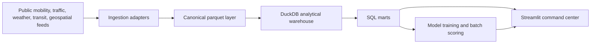

# CityFlow Architecture

## Backend Architecture



## Data Pipeline Design

1. Ingest source data into `data/raw`.
2. Normalize source-specific files into canonical dimensions and fact tables.
3. Store processed data as parquet for efficient reloads.
4. Load DuckDB warehouse tables from parquet.
5. Build SQL marts for dashboard and model training.
6. Train models from `mart_model_scoring_frame`.
7. Serve KPI, geospatial, predictive, and recommendation views through Streamlit.

## Canonical Data Model

- `dim_city`: Indian city metadata, population, registered vehicles, centroid.
- `dim_corridor`: road corridor, zone, road class, capacity, geometry endpoints.
- `fact_mobility_observations`: event-level mobility, traffic, weather, transit delay, incident, and KPI features.

## API / Adapter Design

In production, add source adapters under `src/cityflow/data/adapters/`.

Expected adapter contract:

```python
class SourceAdapter:
    def extract(self) -> pd.DataFrame:
        ...

    def normalize(self, raw: pd.DataFrame) -> pd.DataFrame:
        ...

    def validate(self, normalized: pd.DataFrame) -> None:
        ...
```

Examples:

- `OpenMeteoWeatherAdapter`
- `OsmRoadNetworkAdapter`
- `GtfsTransitAdapter`
- `MunicipalTrafficIncidentAdapter`

## Dashboard UI Layout

- Sidebar: city selector and global filters.
- Header: platform name, selected city, operating context.
- KPI grid: 8 executive KPIs.
- Map: congestion hotspot and infrastructure stress layer.
- Trends: rolling traffic, delay, and weather disruption.
- Heatmap: hour-of-day by day-of-week congestion pattern.
- Corridor table: infrastructure utilization metrics.
- Predictive insights: model metrics and high-risk corridors.
- Recommendations: operational action list.

## Scaling Notes

- DuckDB supports fast local analytical querying for millions of rows.
- Parquet keeps storage efficient and portable.
- Streamlit uses `st.cache_data` and `st.cache_resource`.
- Model training samples from the warehouse using reservoir sampling for repeatable validation.
- The same schema can be moved to PostgreSQL, BigQuery, Snowflake, or Databricks with limited SQL changes.

